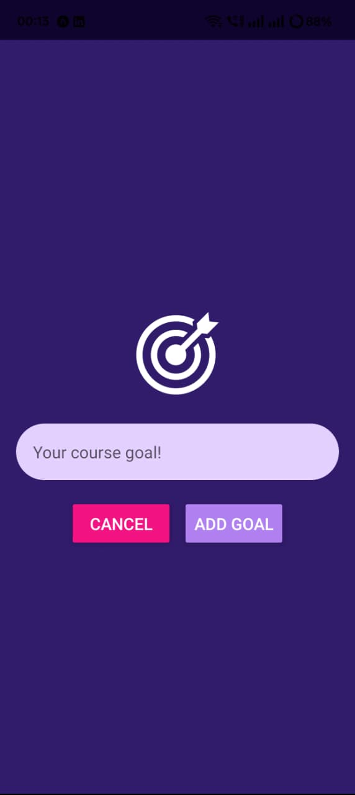
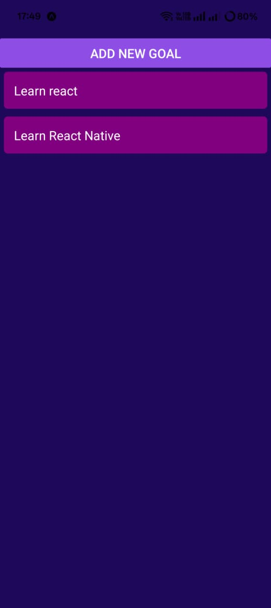

# 📌 React Native Goals App


A simple **React Native app** to add and delete goals.  
Built using `FlatList`, custom components, and modal input.

---

## 🚀 Features
- ➕ Add new goals
- ❌ Delete goals with one tap
- 📱 Clean UI using React Native core components
- 🔥 Works on both Android & iOS

---

## 📷 Screenshots

| Add Goal Screen | Goals List | Delete Goal |
|-----------------|------------|-------------|
|  |  |  |


## 🛠️ Installation

1. Clone the repo
   ```bash
   git clone https://github.com/abhirajdighe/React-Native-Goals-App.git
   cd React-Native-Goals-App

2. Install dependencies
    npm install
    # or
    yarn install

3. Run on Android
    npx react-native run-android

4. Run on iOS (Mac only)
    npx react-native run-ios

📂 Folder Structure

    React-Native-Goals-App/
    │
    ├── components/
    │   ├── GoalInput.js
    │   └── GoalItem.js
    │
    ├── App.js
    ├── package.json
    └── README.md

✨ Acknowledgements

    React Native Docs

    Unsplash
     – Free stock images

    unDraw
     – Open source illustrations

